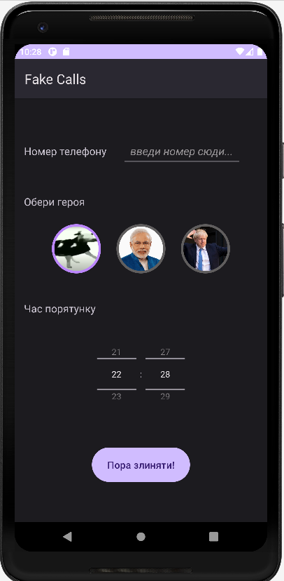
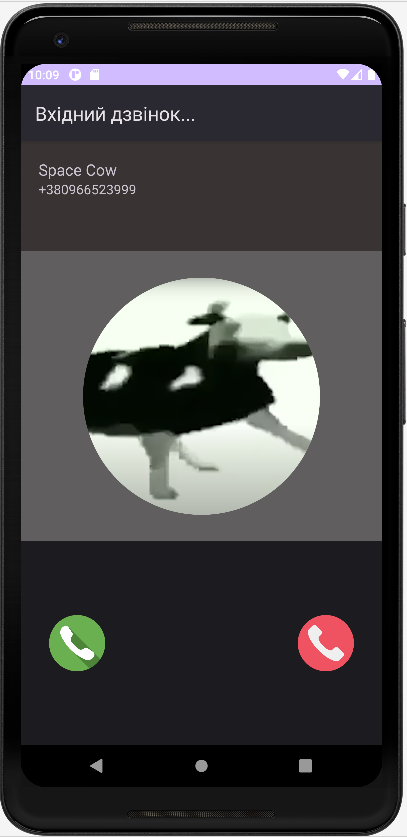

# 📵 FakeCalls
The application is designed to avoid conversations in a real life by scheduling a fake call at the time
you need and answering it to leave the unwanted person

## 👨‍💻 Tech Stack
* Java
* Android studio
* Android SDK (Debugger, emulator, ADB)
* Android Jetpack

## 📱 User Interface
### Here you can enter phone number, time and choose your savior

### This interface will appear when fake call occurs

